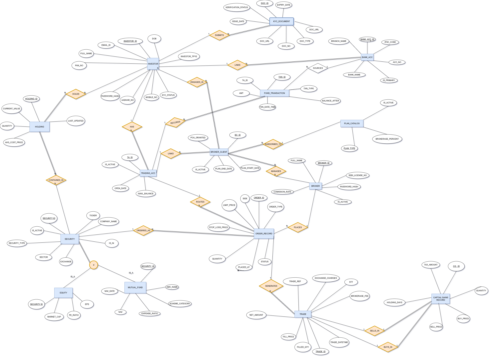

# StockVault — Portfolio Management System

<p align="center">
  
</p>

**StockVault** is a production-grade PostgreSQL database system that models the complete data layer of a stock trading and investment platform. The project covers relational design, BCNF normalization, ISA hierarchies, triggers, views, and 30 real-world SQL queries spanning analytics and application logic.

---

## Table of Contents

- [Project Overview](#project-overview)
- [Architecture](#architecture)
- [Database Schema (14 Tables)](#database-schema-14-tables)
- [Key Design Concepts](#key-design-concepts)
- [Triggers & Business Logic (9 Triggers)](#triggers--business-logic-9-triggers)
- [Views (7 Views)](#views-7-views)
- [SQL Queries (30 Queries)](#sql-queries-30-queries)
- [Project Structure](#project-structure)
- [Getting Started](#getting-started)
- [Example Queries](#example-queries)
- [Tech Stack](#tech-stack)
- [Author](#author)

---

## Project Overview

StockVault models a simplified stock brokerage ecosystem where:

- **Retail and Institutional investors** maintain trading and bank accounts
- Investors complete **KYC verification** before trading
- Investors are associated with **multiple brokers** via subscription plans
- **Equity and Mutual Fund** securities use an ISA (supertype–subtype) hierarchy
- Investors hold **portfolios** with real-time unrealized P&L tracking
- Orders support **MARKET, LIMIT, SL, and SL-M** types with lifecycle management
- Executed orders generate **trade records** with fee breakdowns (brokerage, STT, exchange charges)
- **Fund transactions** (deposits/withdrawals) are fully auditable
- **Capital gains records** track realized profit/loss with STCG/LTCG classification
- **Triggers** automate balance updates, holdings management, and audit logging

The schema is normalized to **Boyce–Codd Normal Form (BCNF)** and targets **PostgreSQL 15+**.

---

## Architecture

```
┌──────────────────────────────────────────────────────────────────┐
│                        StockVault Schema                         │
├──────────────────────────────────────────────────────────────────┤
│                                                                  │
│  INVESTOR ──┬── KYC_DOCUMENT                                     │
│  (Retail /  ├── TRADING_ACC ──┬── ORDER_RECORD ── TRADE          │
│   Instit.)  ├── BANK_ACC     │                    │              │
│             ├── HOLDING       ├── FUND_TRANSACTION │              │
│             └── BROKER_CLIENT │                    └── CAPITAL_   │
│                    │          │                        GAINS_     │
│                  BROKER     PLAN_CATALOG               RECORD    │
│                                                                  │
│  SECURITY ──┬── EQUITY                                           │
│             └── MUTUAL_FUND                                      │
│                                                                  │
│  + investor_audit_log (audit trail)                              │
└──────────────────────────────────────────────────────────────────┘
```

---

## Database Schema (14 Tables)

| Category | Tables | Description |
|----------|--------|-------------|
| **Investor Management** | `INVESTOR` | Core entity with ISA discrimination (`RETAIL` / `INSTITUTIONAL`) via check constraints |
| **KYC** | `KYC_DOCUMENT` | PAN, Aadhaar, Passport, Driving License with verification status |
| **Accounts & Funds** | `TRADING_ACC`, `BANK_ACC`, `FUND_TRANSACTION` | Trading balance, linked bank accounts, deposit/withdrawal ledger |
| **Broker Management** | `BROKER`, `PLAN_CATALOG`, `BROKER_CLIENT` | Broker profiles, subscription plans (BASIC/STANDARD/PREMIUM/ENTERPRISE), investor–broker relationships |
| **Securities** | `SECURITY`, `EQUITY`, `MUTUAL_FUND` | ISA hierarchy — base security with subtype-specific attributes |
| **Portfolio** | `HOLDING` | Investor holdings with quantity, avg cost, current value, unrealized P&L |
| **Trading** | `ORDER_RECORD`, `TRADE` | Full order lifecycle (OPEN → PARTIAL → EXECUTED / CANCELLED) with trade fills |
| **Tax & Gains** | `CAPITAL_GAINS_RECORD` | Buy–sell lot matching with STCG/LTCG classification |

---

## Key Design Concepts

### ISA Hierarchies (Supertype–Subtype)

```
INVESTOR                    SECURITY
├── RETAIL (risk_profile)   ├── EQUITY (market_cap, pe_ratio, eps)
└── INSTITUTIONAL (cin_no)  └── MUTUAL_FUND (nav, amc_name, expense_ratio)
```

Subtype tables share the supertype's primary key as both PK and FK.

### BCNF Normalization

- **Brokerage plan decomposition**: `PLAN_TYPE → BROKERAGE_PERCENT` extracted into `PLAN_CATALOG`
- **Investor subtype discrimination**: Conditional check constraint enforces `RETAIL` has no `CIN_NO`, `INSTITUTIONAL` has no `RISK_PROFILE`

### Partial Unique Index

Ensures at most one primary bank account per investor:

```sql
CREATE UNIQUE INDEX uq_bank_acc_one_primary_per_investor
    ON BANK_ACC (INVESTOR_ID) WHERE IS_PRIMARY = TRUE;
```

### Conditional Check Constraints

LIMIT orders require a limit price, SL orders require a stop-loss price:

```sql
CHECK (ORDER_TYPE NOT IN ('LIMIT','SL') OR LIMIT_PRICE IS NOT NULL)
CHECK (ORDER_TYPE NOT IN ('SL','SL-M') OR STOP_LOSS_PRICE IS NOT NULL)
```

---

## Triggers & Business Logic (9 Triggers)

| # | Trigger | Event | What it does |
|---|---------|-------|--------------|
| T1 | `trg_fund_txn_update_balance` | BEFORE INSERT on `FUND_TRANSACTION` | Auto-updates trading account balance; validates sufficient funds for withdrawals |
| T2 | `trg_trade_compute_net` | BEFORE INSERT on `TRADE` | Computes `NET_AMOUNT` = gross ± fees based on BUY/SELL side |
| T3 | `trg_validate_order` | BEFORE INSERT on `ORDER_RECORD` | Blocks orders if KYC not VERIFIED, account inactive, or insufficient SELL holdings |
| T4 | `trg_trade_update_holdings` | AFTER INSERT on `TRADE` | Upserts holdings with weighted-average cost on BUY; reduces on SELL |
| T5 | `trg_trade_update_order_status` | AFTER INSERT on `TRADE` | Marks order EXECUTED when fully filled, PARTIAL otherwise |
| T6 | `trg_trade_adjust_balance` | AFTER INSERT on `TRADE` | Deducts balance on BUY trades, credits on SELL trades |
| T7 | `trg_order_check_broker_active` | BEFORE INSERT/UPDATE on `ORDER_RECORD` | Prevents assigning orders to inactive brokers |
| T8 | `trg_order_prevent_cancel_executed` | BEFORE UPDATE on `ORDER_RECORD` | Blocks cancellation of EXECUTED/PARTIAL orders |
| T9 | `trg_investor_audit` | AFTER UPDATE on `INVESTOR` | Logs email, KYC status, and active status changes to `investor_audit_log` |

> **Note:** T3, T4, T5, T6 are disabled during seed data loading to prevent conflicts. Enable them after seeding.

---

## Views (7 Views)

| View | Purpose |
|------|---------|
| `v_investor_profile` | Full investor profile with KYC doc count and trading account info |
| `v_portfolio_summary` | Holdings with unrealized P&L (amount and %) |
| `v_order_with_trade` | Orders left-joined with trade details (includes unfilled orders) |
| `v_broker_performance` | Dashboard: total revenue, execution rate, avg trade value, avg exec time |
| `v_security_details` | Unified equity + mutual fund details in one row |
| `v_fund_ledger` | Fund transactions with investor name and bank account info |
| `v_capital_gains` | Capital gains with STCG/LTCG classification |

---

## SQL Queries (30 Queries)

### Analytical Queries (13)

| # | Query | Concepts Used |
|---|-------|--------------|
| 1 | Broker revenue in last 3 months | LEFT JOIN, COALESCE, SUM, date arithmetic |
| 2 | Top 10 most traded securities (30 days) | Aggregate + LIMIT, LEFT JOIN |
| 3 | Monthly trade count & revenue per broker | DATE_TRUNC, COUNT DISTINCT |
| 4 | Dormant investors (no order in 30 days) | HAVING on MAX aggregate |
| 5 | Average trade value per broker | AVG, ROUND |
| 6 | Top brokers by commission + exec time | EXTRACT(EPOCH), interval arithmetic |
| 7 | KYC documents expiring within 30 days | BETWEEN on dates, partial index scan |
| 8 | Verified investors who never traded | NOT EXISTS correlated subquery |
| 9 | Average execution time per broker | INNER JOIN (only active brokers) |
| 10 | Plan subscription → trade conversion rate | NULLIF, conditional COUNT DISTINCT |
| 11 | Order cancellation rate by type | Conditional aggregation (SUM CASE) |
| 12 | Stale open orders (>7 days) | Partial index, range scan |
| 13 | Orders handled per broker (execution rate) | COUNT ratio, ::NUMERIC cast |

### Application Queries (17)

| # | Query | Operation |
|---|-------|-----------|
| 1 | List securities by exchange | SELECT with filter |
| 2 | Search securities (autocomplete) | ILIKE pattern matching |
| 3 | Security details page | LEFT JOIN ISA subtypes |
| 4 | Get investor portfolio | JOIN + inline P&L computation |
| 5 | Place order | INSERT |
| 6 | Cancel order | UPDATE with status guard |
| 7 | Get KYC documents | SELECT ordered by date |
| 8 | Get primary bank account | Partial unique index lookup |
| 9 | Validate order (balance/holdings) | CASE expression |
| 10 | Record trade execution | INSERT + UPDATE (transaction) |
| 11 | Update holdings (upsert) | ON CONFLICT DO UPDATE |
| 12 | Create fund transaction | INSERT |
| 13 | Update balance after fund txn | CASE-based UPDATE |
| 14 | Order history with trades | LEFT JOIN + pagination |
| 15 | List bank accounts | SELECT ordered by primary flag |
| 16 | Active broker relationships | JOIN with active filter |
| 17 | Broker commission summary | Aggregate with COALESCE |

---

## Project Structure

```
StockVault/
├── README.md                               ← You are here
├── 202401077_ERD_Relational_BCNF-Proofs.pdf
├── BCNF_Proofs.md
├── newfile.md
│
├── Schema/
│   └── ER_Schema_StockVault.png            ← ER Diagram
│
├── database/
│   └── schema/
│       ├── final_ddl.sql                   ← CREATE TABLE (14 tables)
│       ├── seed_data.sql                   ← INSERT sample data
│       ├── indexes.sql                     ← 16 performance indexes
│       ├── views.sql                       ← 7 reusable views
│       └── triggers_functions.sql          ← 9 functions + 9 triggers
│
└── SQL/
    ├── analytic_queries.sql                ← 13 analytical queries
    └── application_queries.sql             ← 17 application queries
```

---

## Getting Started

### Prerequisites

- **PostgreSQL 15** or later
- `psql` CLI or a GUI like pgAdmin / DBeaver

### Setup (5 steps)

```bash
# 1. Create the database
psql -U postgres -c "CREATE DATABASE stockvault;"

# 2. Create schema and tables
psql -U postgres -d stockvault -f database/schema/final_ddl.sql

# 3. Load sample data
psql -U postgres -d stockvault -f database/schema/seed_data.sql

# 4. Create performance indexes
psql -U postgres -d stockvault -f database/schema/indexes.sql

# 5. Create views and triggers
psql -U postgres -d stockvault -f database/schema/views.sql
psql -U postgres -d stockvault -f database/schema/triggers_functions.sql
```

### Enable triggers (after seeding)

```sql
SET search_path TO trading;

ALTER TABLE order_record ENABLE TRIGGER trg_validate_order;
ALTER TABLE trade ENABLE TRIGGER trg_trade_update_holdings;
ALTER TABLE trade ENABLE TRIGGER trg_trade_update_order_status;
ALTER TABLE trade ENABLE TRIGGER trg_trade_adjust_balance;
```

### Verify setup

```sql
SET search_path TO trading;

SELECT table_name
FROM information_schema.tables
WHERE table_schema = 'trading'
ORDER BY table_name;
```

---

## Example Queries

### Portfolio with unrealized P&L

```sql
SELECT investor_name, ticker, quantity, avg_cost_price,
       current_value, unrealized_pnl, pnl_pct
FROM v_portfolio_summary
ORDER BY current_value DESC;
```

### Broker performance dashboard

```sql
SELECT full_name, total_trades, total_revenue,
       avg_trade_value, avg_exec_minutes, execution_rate
FROM v_broker_performance
ORDER BY total_revenue DESC;
```

### KYC documents expiring soon

```sql
SELECT i.full_name, k.doc_type, k.expiry_date
FROM kyc_document k
JOIN investor i ON k.investor_id = i.investor_id
WHERE k.expiry_date BETWEEN CURRENT_DATE AND CURRENT_DATE + INTERVAL '30 days'
  AND k.verification_status = 'VERIFIED';
```

### Test a fund deposit (trigger auto-updates balance)

```sql
SET search_path TO trading;

-- Check balance before
SELECT ta_id, avail_balance FROM trading_acc WHERE ta_id = 1;

-- Deposit ₹1,00,000
INSERT INTO fund_transaction (ta_id, bank_acc_id, txn_type, amt)
VALUES (1, 1, 'DEPOSIT', 100000.00);

-- Balance is now auto-updated
SELECT ta_id, avail_balance FROM trading_acc WHERE ta_id = 1;
```

---

## Design Highlights

- ✅ PostgreSQL 15+ compatible
- ✅ BCNF-normalized relational design
- ✅ 14 production tables with 30 SQL queries
- ✅ ISA supertype–subtype modeling (Investor, Security)
- ✅ UUID and IDENTITY-based surrogate keys
- ✅ 9 triggers for automated business logic
- ✅ 7 reusable views for dashboards and reports
- ✅ 16 performance indexes (including 3 partial indexes)
- ✅ Investor audit logging
- ✅ Comprehensive seed data for all tables
- ✅ Password hashing (bcrypt-compatible `PASSWORD_HASH`)
- ✅ Conditional check constraints (order type validation)
- ✅ Partial unique index (one primary bank account)

---

## Tech Stack

| Component | Technology |
|-----------|------------|
| Database | PostgreSQL 15 |
| Language | SQL, PL/pgSQL |
| Design | Relational Model, BCNF |
| Concepts | Normalization, ISA Hierarchy, Triggers, Views, Indexes, Audit Logging, Partial Indexes |

---

## Author

**Pranamya Sanghvi**

B.Tech — Information and Communication Technology
Dhirubhai Ambani Institute of Information and Communication Technology, Gandhinagar
